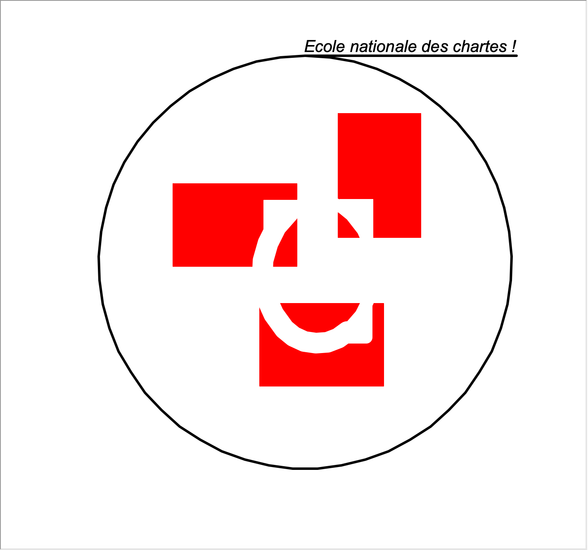

# Logo-ENC_PyTurtle

Réinterprétation du logo de l'Ecole des chartes à partir du module de dessin Turtle de Python

## Contributeurs :

@Sarabi34
@jeandamien-genero

---------------------

## Modèle utilisé 

Référence image : https://twitter.com/ecoledeschartes 

## Modèle avec PyTurtle

## Commentaires sur le script 

- la fonction cd_graph() permet de tracer les axes graphiques x-y qui peuvent être utile pour la réalisation 
du dessin. On peut la desactiver lors de l'execution du dessin.
- changer la couleur pour essayer d'obtenir un rouge plus sombre. 
- trouver le parmètre pour faire des coins plus arrondis.

